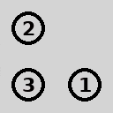
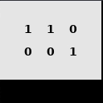
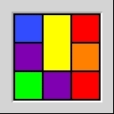
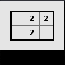
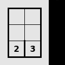

# RLP: A Reinforcement Learning Benchmark for Neural Algorithmic Reasoning

## Description

This code supports the ICLR 2024 Submission _RLP: A Reinforcement Learning Benchmark for Neural Algorithmic Reasoning_.

We provide `RLP`, a Reinforcement Learning (RL) environment based on [Simon Tatham's Portable Puzzle Collection](https://www.chiark.greenend.org.uk/~sgtatham/puzzles/), designed for use with [Farama's Gymnasium](https://gymnasium.farama.org/) RL tools.

Along with `RLP`, you may find scripts that enable reproduction of the results presented in the paper. To this end, we give instructions on how to use them below.

<p float="left">





</p>

## Installation Guide

### Requirements

Python 3.10+, a reasonably recent C compiler such as GCC or Clang, [CMake](https://cmake.org/) 3.26.

We only tested the code on Linux.

### Step-by-step Guide

First, clone the git repository to your local machine.

```shell
git clone https://github.com/rlppaper/rlp.git
```

Step into the directory.

```shell
cd rlp
```

Install all required packages and build the C libraries.

```shell
./install.sh
```

Activate `RLP`'s virtual Python environment.

```shell
source rlpvenv/bin/activate
```

## Usage Guide

After successfully following the Installation Guide, you can now run the `RLP` environment!

When initializing a puzzle, you must supply the desired puzzle's name. Refer to the [list of puzzle names](#list-of-puzzles).

You may find the exact commands to reproduce the paper's experiments in [experiment_commands.txt](experiment_commands.txt).

### Train an Agent

In order to train an agent in a specific puzzle, run the following command in the repository's top level.

```shell
./run_training.py --puzzle <name of puzzle> --arg <parameters>
```

Run `./run_training.py --help` for the full range of customizable options.

Check the [list of puzzle names](#list-of-puzzles).

### Run a previously trained Agent

In order to run an agent previously trained on a specific puzzle, run the following command in the repository's top level.

```shell
./run_trained_agent.py --puzzle <name of puzzle> --arg <parameters>
```

Run `./run_trained_agent.py --help` for the full range of customizable options.

Check the [list of puzzle names](#list-of-puzzles).

### Random Agent

To have an agent perform random actions in one of the puzzles, run the following command in the repository's top level:

```shell
./run_random.py --puzzle <name of puzzle> --arg <parameters>
```

Run `./run_random.py --help` for the full range of customizable options.

Check the [list of puzzle names](#list-of-puzzles).

### Manual Play

To manually play one of the puzzles, run the following command in the repository's top level:

```shell
./run_puzzle.py --puzzle <name of puzzle>
```

Run `./run_puzzle.py --help` for the full range of customizable options.

Check the [list of puzzle names](#list-of-puzzles).

### List of Puzzles

<table>
  <tbody>
    <tr>
      <td width='20%' align='center'>
        blackbox
      </td>
      <td width='20%' align='center'>
        bridges
      </td>
      <td width='20%' align='center'>
        cube
      </td>
      <td width='20%' align='center'>
        dominosa
      </td>
      <td width='20%' align='center'>
        fifteen
      </td>
    </tr>
    <tr>
      <td width='20%' align='center'>
        filling
      </td>
      <td width='20%' align='center'>
        flip
      </td>
      <td width='20%' align='center'>
        flood
      </td>
      <td width='20%' align='center'>
        galaxies
      </td>
      <td width='20%' align='center'>
        guess
      </td>
    </tr>
    <tr>
      <td width='20%' align='center'>
        inertia
      </td>
      <td width='20%' align='center'>
        keen
      </td>
      <td width='20%' align='center'>
        lightup
      </td>
      <td width='20%' align='center'>
        loopy
      </td>
      <td width='20%' align='center'>
        magnets
      </td>
    </tr>
    <tr>
      <td width='20%' align='center'>
        map
      </td>
      <td width='20%' align='center'>
        mines
      </td>
      <td width='20%' align='center'>
        mosaic
      </td>
      <td width='20%' align='center'>
        net
      </td>
      <td width='20%' align='center'>
        netslide
      </td>
    </tr>
    <tr>
      <td width='20%' align='center'>
        palisade
      </td>
      <td width='20%' align='center'>
        pattern
      </td>
      <td width='20%' align='center'>
        pearl
      </td>
      <td width='20%' align='center'>
        pegs
      </td>
      <td width='20%' align='center'>
        range
      </td>
    </tr>
    <tr>
      <td width='20%' align='center'>
        rect
      </td>
      <td width='20%' align='center'>
        samegame
      </td>
      <td width='20%' align='center'>
        signpost
      </td>
      <td width='20%' align='center'>
        singles
      </td>
      <td width='20%' align='center'>
        sixteen
      </td>
    </tr>
    <tr>
      <td width='20%' align='center'>
        slant
      </td>
      <td width='20%' align='center'>
        solo
      </td>
      <td width='20%' align='center'>
        tents
      </td>
      <td width='20%' align='center'>
        towers
      </td>
      <td width='20%' align='center'>
        tracks
      </td>
    </tr>
    <tr>
      <td width='20%' align='center'>
        twiddle
      </td>
      <td width='20%' align='center'>
        undead
      </td>
      <td width='20%' align='center'>
        unequal
      </td>
      <td width='20%' align='center'>
        unruly
      </td>
      <td width='20%' align='center'>
        untangle
      </td>
    </tr>
  </tbody>
</table>

## Developer Notes

### Custom Reward Structure

One can use a Gymnasium environment wrapper ([Documentation](https://gymnasium.farama.org/tutorials/gymnasium_basics/implementing_custom_wrappers/)) to give out custom rewards in order to improve the agent's learning process.
The puzzle's internal game state is provided in the `info` dict created by the environment after each `step()`. Its attributes can be accessed using

```python
info['puzzle_state']['<attribute name>']
```

An example can be found in [custom_rewards_example.py](custom_rewards_example.py).

### Adding a new puzzle

A new puzzle can be added by creating a new C backend including the game logic and associated data structures. For more details we refer to [Simon Tatham’s developer documentation](https://www.chiark.greenend.org.uk/~sgtatham/puzzles/devel/writing.html#writing). The new C file should be placed in the folder `puzzles`, where the other backend files are located. Subsequently, the new puzzle needs to be added to the build system by adding an entry in [puzzles/CMakeLists.txt](puzzles/CMakeLists.txt).

Additionally, certain functions in our environment need to be implemented or adapted, such as retrieving the dictionary containing the puzzles’ logical state. 
The relevant code needs to be modified in the files [rlp/specific_api.py](rlp/specific_api.py) and [rlp/envs/observation_spaces.py](rlp/envs/observation_spaces.py).

<table>
<tr>
<th>
Function
</th>
<th>
Description
</th>
</tr>

<tr>

<td>
<pre>
make_puzzle_state()
</pre>
</td>

<td>
Converts the data structures that represent a puzzle's internal logical state to a Python dict.
</td>

</tr>

<tr>

<td>
<pre>
set_api_structures_newpuzzle()
</pre>
</td>

<td>
Sets the <i>ctypes</i> definitions for the backend's <i>game_params</i>, <i>game_ui</i>, <i>game_drawstate</i>, <i>game_state</i> and their associated classes.
</td>

</tr>

<tr>

<td>
<pre>
get_action_keys_newpuzzle()
</pre>
</td>

<td>
Returns a <i>dict</i> containing all keyboard keys used to play a puzzle. 
</td>

</tr>


<tr>

<td>
<pre>
get_observation_space_newpuzzle()
</pre>
</td>

<td>
Returns a <i>dict</i> containing the internal data observation space for a puzzle. 
</td>

</tr>

<tr>

<td>
<pre>
get_observation_newpuzzle()
</pre>
</td>

<td>
Returns a <i>dict</i> containing the internal data observation for a puzzle. 
</td>

</tr>
</table>

For the latter four, the new functions need to be added in the four dicts `set_api_structures_methods`, `get_action_keys_methods`, `get_observation_space_methods` and `get_observation_methods` respectively.


## License

The `RLP` code is released under the CC BY-NC 4.0 license. For more information, see [LICENSE](LICENSE).

Simon Tatham's Portable Puzzle Collection is licensed under the MIT License, see [puzzles/LICENCE](puzzles/LICENCE).
